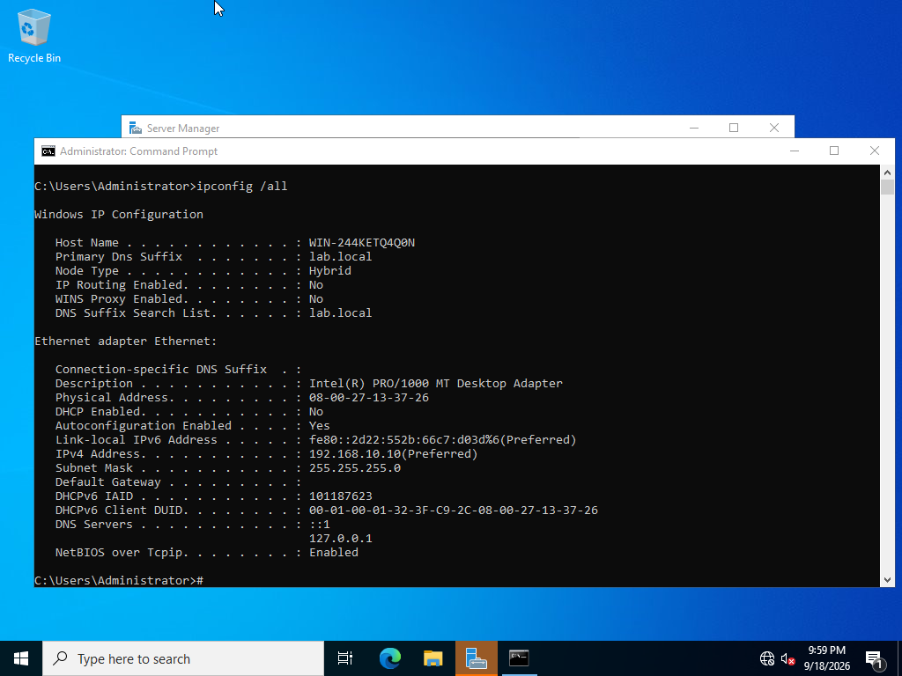
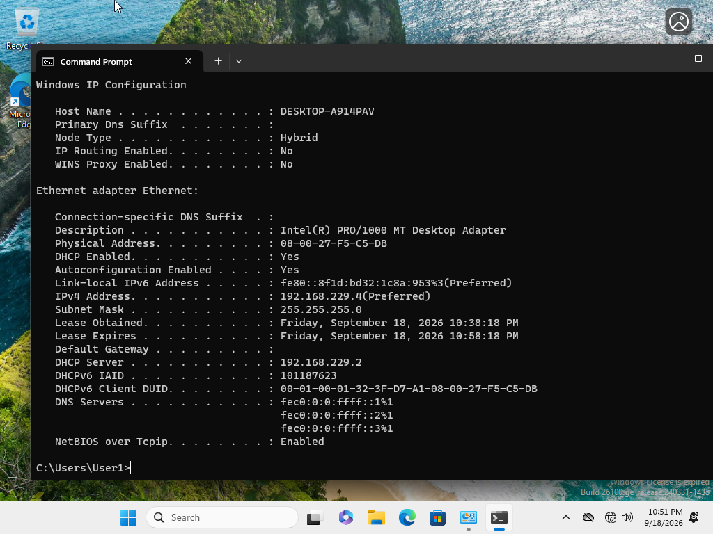
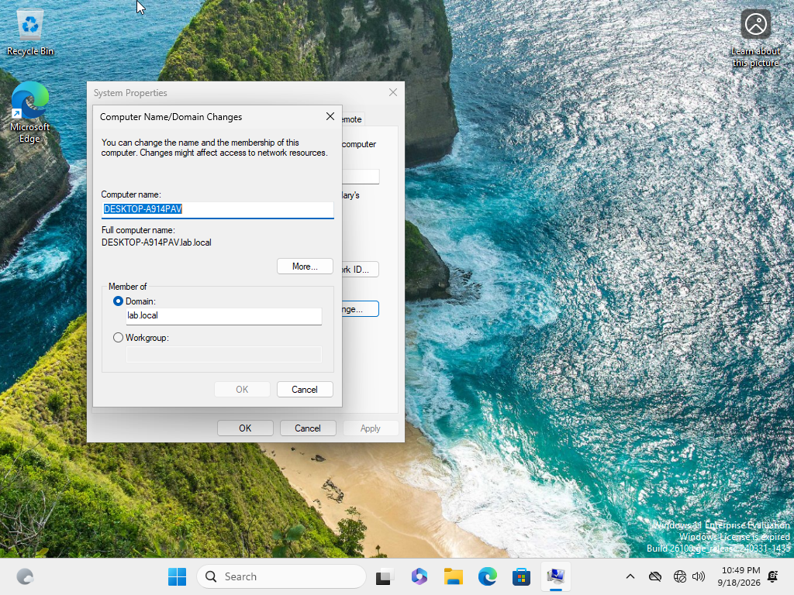
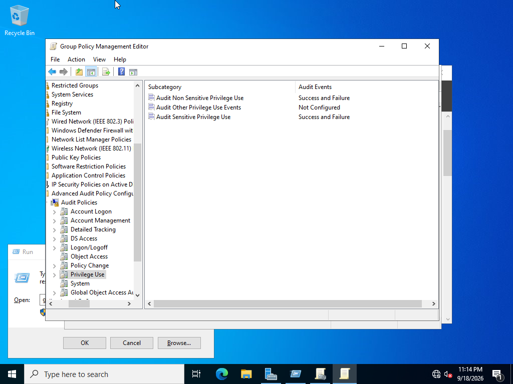
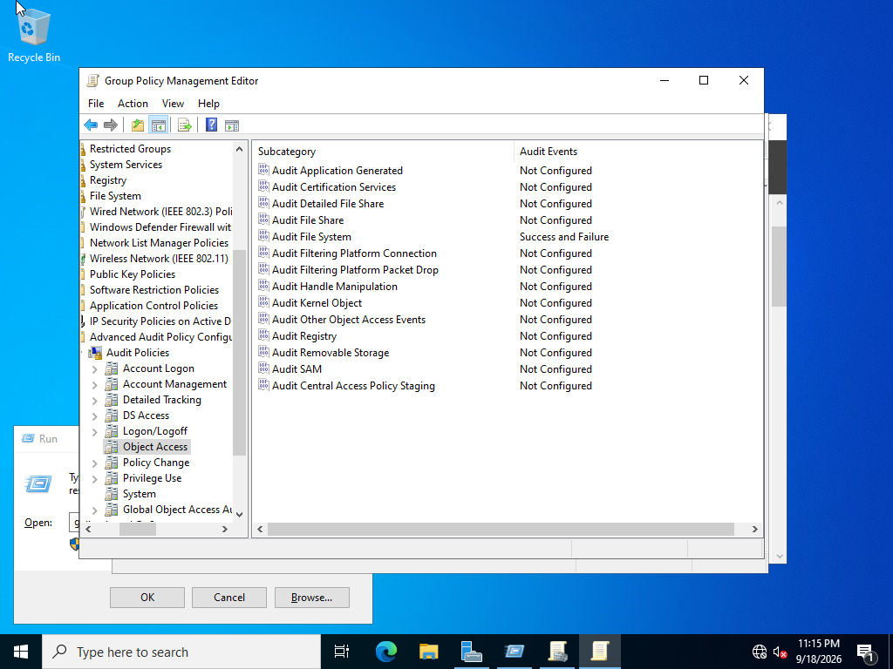
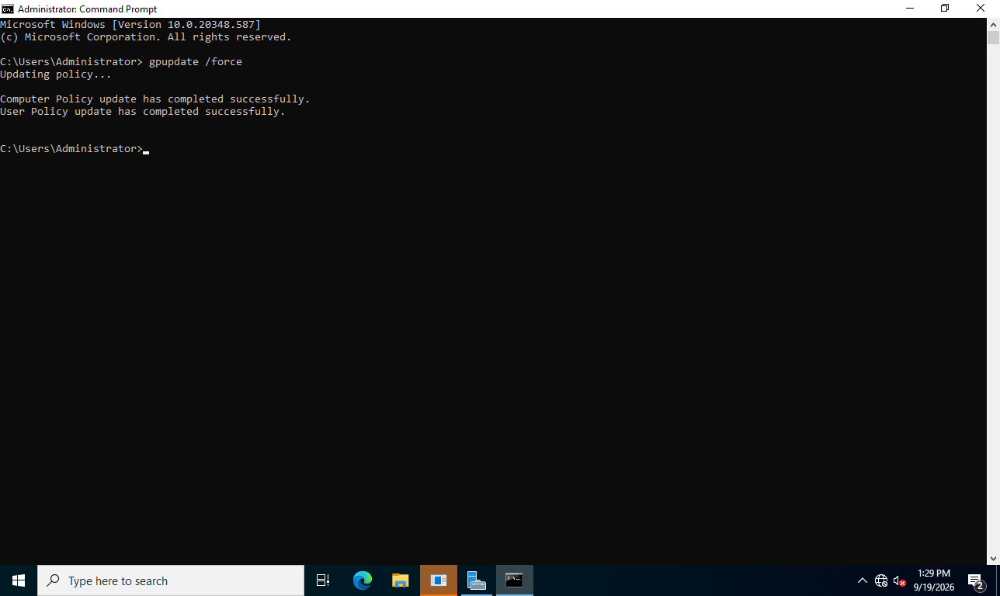
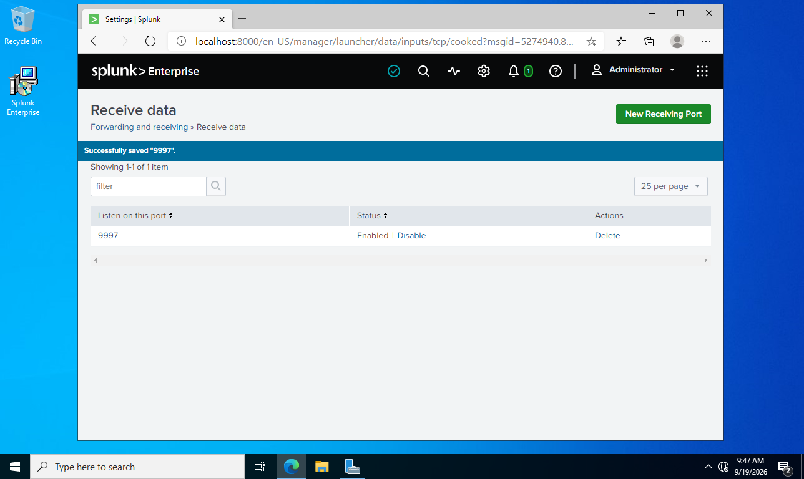
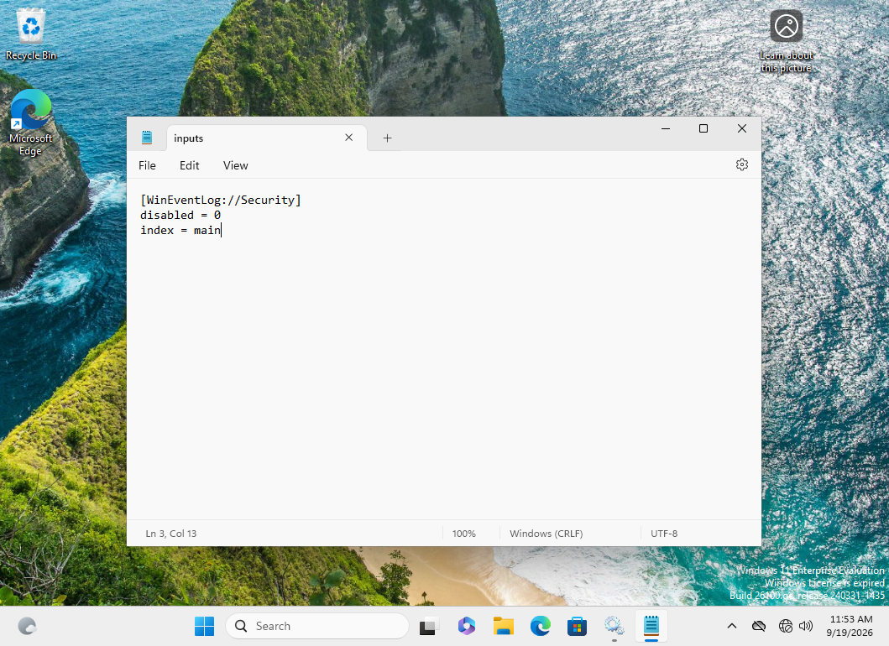
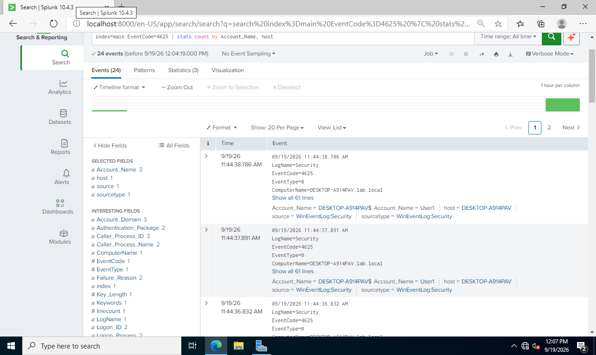
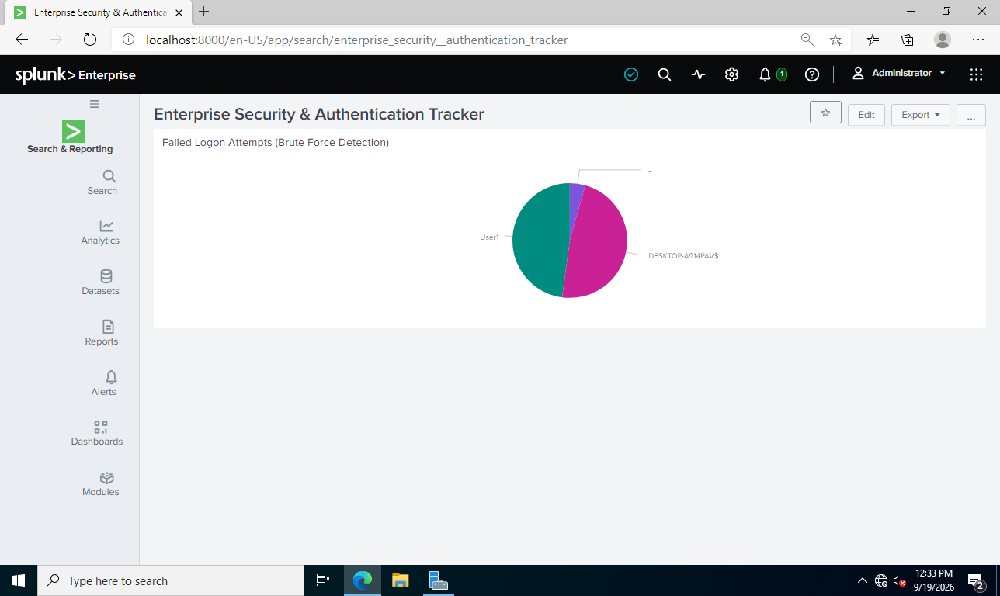

# Active Directory & Splunk SIEM Detection Lab

## Project Overview
This project demonstrates the design, deployment, and configuration of an isolated enterprise Active Directory environment integrated with Splunk Enterprise SIEM. The lab simulates real-world Security Operations Center (SOC) telemetry pipelines, advanced GPO audit logging policies, brute-force attack simulations, and custom Search Processing Language (SPL) detection engineering.

---

## Lab Architecture & Network Topology

- **Network Subnet:** `192.168.10.0/24` (VirtualBox Host-Only Isolated Network, Gateway: `192.168.10.1`, No DHCP)
- **Domain Controller (`WinDC`):** Windows Server 2022 | IP: `192.168.10.10` | Domain: `lab.local`
  - Active Directory Domain Services (AD DS), Domain DNS, Group Policy Management, Splunk Enterprise (Receiver Port 9997)
- **Workstation (`Win10`):** Windows 10 Workstation | IP: `192.168.10.20` | Domain-joined (`lab.local`)
  - Generates Windows Event Logs, Splunk Universal Forwarder Agent

---

## Phase 1: Network Isolation & Identity Provisioning

### 1. Host-Only Network Setup
Configured an isolated VirtualBox Host-Only network adapter (`192.168.10.1/24`) with DHCP disabled to enforce static IP addressing and prevent conflict with production networks.

### 2. VM 1 (WinDC) Static IP Verification
Configured Windows Server 2022 with static IP `192.168.10.10` and self-referencing primary DNS (`192.168.10.10`).



### 3. VM 2 (Win10) Static IP & Domain Join Verification
Configured Windows 10 with static IP `192.168.10.20` pointing to `192.168.10.10` for DNS, then joined the domain `lab.local`.





---

## Phase 2: Enhanced Telemetry via GPO Audit Policies

Configured the **Default Domain Policy** via Group Policy Management (`gpmc.msc`) on `WinDC` to enforce audit logging baselines across domain endpoints:

- **Audit Logon (Success & Failure):** Records all login attempts (Event IDs 4624 & 4625).
- **Audit Privilege Use (Success & Failure):** Tracks elevated rights and administrative actions.
- **Audit File System (Success & Failure):** Logs unauthorized sensitive file modifications/access.

Policy update enforced across endpoints using `gpupdate /force`.

 

 

 

 

---

## Phase 3: Ingestion Pipeline & Splunk Universal Forwarder

### 1. Splunk Enterprise Receiving Setup
Installed Splunk Enterprise on `WinDC` and opened TCP receiving port **9997** (`Settings -> Forwarding and receiving`).



### 2. Universal Forwarder Log Forwarding (`inputs.conf`)
Installed Splunk Universal Forwarder on `Win11` pointing to indexer `192.168.10.10:9997`. Configured `inputs.conf` to stream local Windows Security logs:

 

---

## Phase 4: Attack Simulation & Threat Detection

To validate my security logging pipeline, I simulated a controlled brute-force attack against the endpoint workstation. I then ingested the telemetry into Splunk Enterprise, analyzed it using custom Search Processing Language (SPL) queries, and correlated events across Windows Event IDs.

---

### Step 4.1: Attack Simulation Scenario
1. Navigated to **VM 2 (`Win11`)** and locked the desktop environment (`Win + L`).
2. Initiated a brute-force authentication sequence by attempting to log in as `lab.local\Administrator` with incorrect passwords **4 consecutive times**.
3. Authenticated successfully on the **5th attempt** using the valid password to generate baseline success metrics.

---

### Step 4.2: SPL Detection Queries & Telemetry Analysis

#### Query 1: Verify Live Endpoint Connectivity
Confirms active event ingestion and log streaming from the `Win11` workstation to the central Splunk indexer.

```spl
index=main host="DESKTOP-A914PAV"
```

#### Query 2: Detect Failed Logons / Brute-Force Attacks (Event ID 4625)
Aggregates authentication failure events to identify potential password spraying, dictionary attacks, or brute-force activity.

```spl
index=main EventCode=4625 | stats count by Account_Name, host 
```
 

### My SPL Pipeline Breakdown

- index=main EventCode=4625: Filters raw Windows event logs specifically for failed logon events (4625).

- | stats count by Account_Name, host: Groups total failure counts by target account name and reporting host.

---

## Phase 5: Building the SOC Security Dashboard

To enable continuous security monitoring and quick-reaction visibility, I built a real-time visual dashboard panel inside Splunk Web.

### Dashboard Configuration Details:

- Dashboard Title: Enterprise Security & Authentication Tracker
- Panel Title: Failed Logon Attempts (Brute Force Detection)
- Underlying Query:
```spl
index=main EventCode=4625 | stats count by Account_Name
```
- Visualization: Pie Chart


